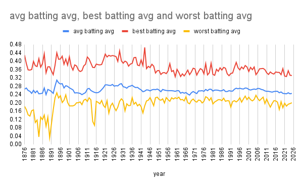

# Some Batting Average stats from 1876 - 2025

In this article I am going to look at some batting averege statistics that i find cool including the best and worst hitters each year and the average batting average each year i also used negro league stats

## The graph

This graph shows the peak batting average each year in red, the average batting average in blue and the worst batting average in yellow.

## Peaks, dips and other things worth noting

One thing you can see is that the average always stayed pretty close to the bottom showing that the top hitters are a lot farther then the rest. You can see that in 1890 every line fell. I'm not sure why this is but it could have something to do with there being more teams in mlb then vs other simalar years. just a few years later, all lines got very close together. This shows that in this year the best worst and middle were not that far apart. One huge spike you can see is in the early 1940s this huge spike is coming from a negro leagues player josh gibson. this spike happend when his team, the homestead grays were really good. in the top 4 that year for batting avg 3 of his teamates were in it from the late 90s to 2020s you can see a slow, graduall decrease in all lines, this is because the mindset has changed to more home runs and less hits. Some of the early dips are just because of pitchers having really, really bad seasons.
