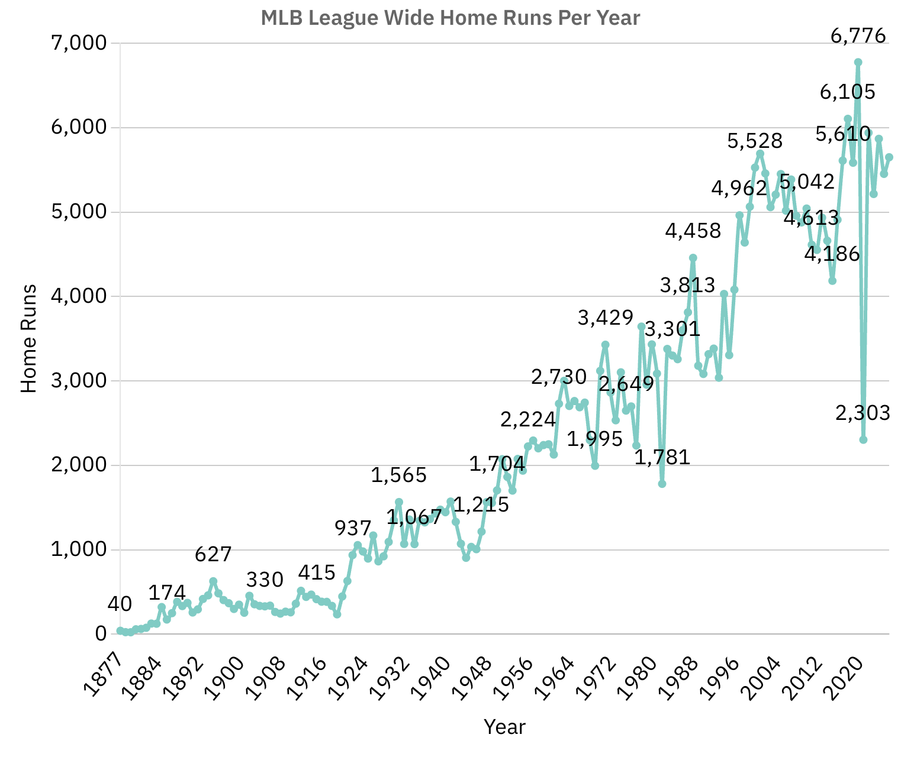
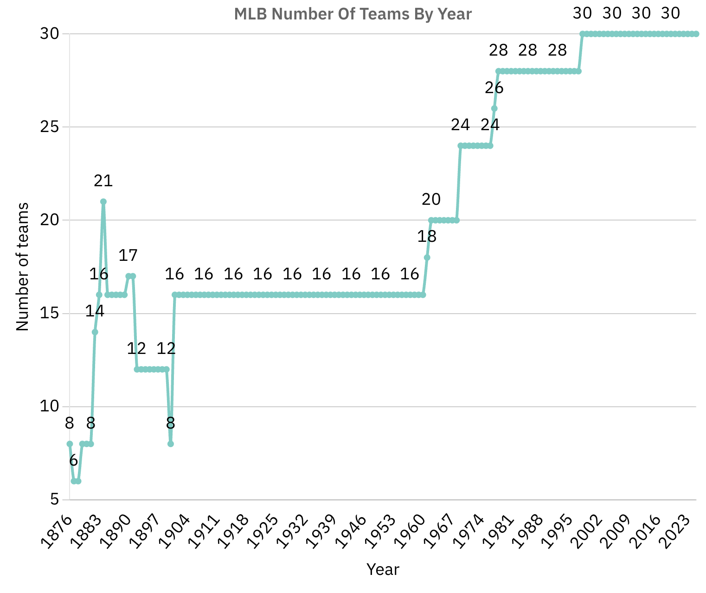
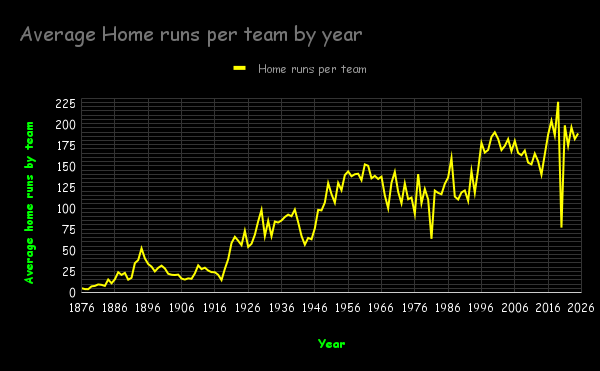

# An analysis of Home Runs and other stats by year

Starting in 1876 Major League Baseball only had a total of 40 Home Runs but recently that number has gone up to the high five thousands. There could be a lot of reasons why, perhaps there being more teams now, or maybe because players try to hit the ball harder now. In this article i will dive deep into all aspects of this!

## MLB Home Runs per year

This line graph shows the Home Runs in all of mlb per year from 1876 to 2025. When baseball was founded in 1876 40 home runs were hit, but in the next season there was only 24 Home Runs. one possible reason for that is there was 8 teams in 1876, but in 1877 there was only 6. In the early years of baseball the total number of teams bounced around a lot which could explain some home run totals. see this graph of teams each year

## Spikes and Dips in the charts

One thing you might have seen is the huge spike in teams in 1884 but a very small spike in Home runs That might be because a lot of the teams folded mid season. another big spike is the surge up in the 1920s in home runs a possible reason for that could be the slugging of power hitters like the "murderers row" yankees led by babe ruth and other sluggers like george sisler, "shoeless" joe jackson among others.The home run graph continues to head up with the years but this also flows with the idea of home runs over singles growing and growth hormones becoming popular. I am not quite sure why home runs trended down from the late 90s to the early 2010s because sticky stuff wasn't banned until 2021 but it could have somthing to with the rise in pitchers throwing more no-hitters including 3! perfect games in 2012 it could also be related to the crackdown on steroids. There was one final drop in 2020 and it was the biggest change on the whole graph! the reason there were so little home runs that year is because covid-19 lockdowned baseball and shortend the season to 60 games.

The chart below proves that home runs aren't fully connected to the expansion of the sport

 
